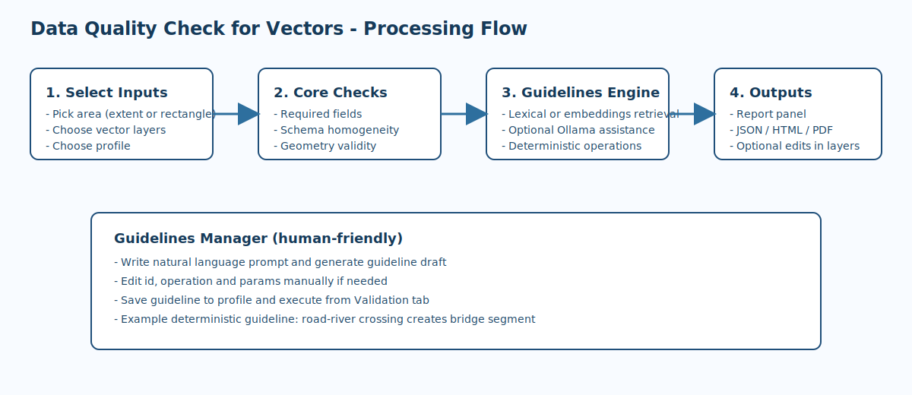
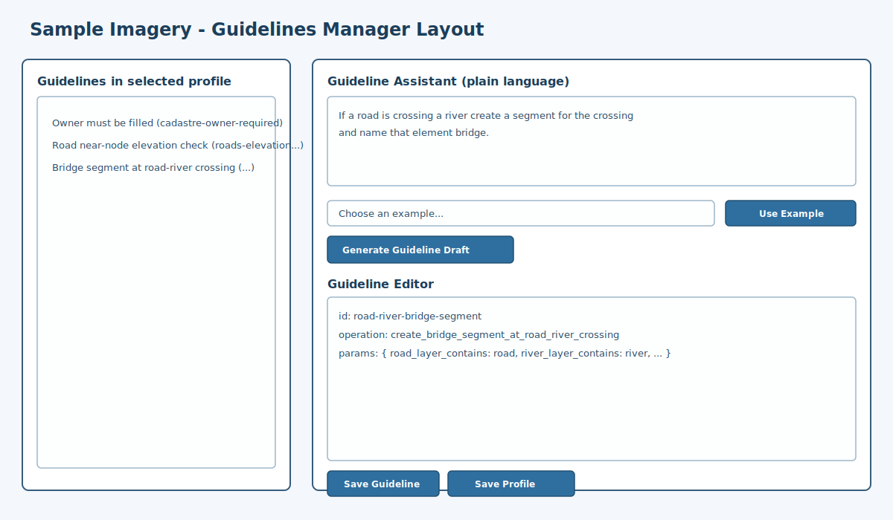
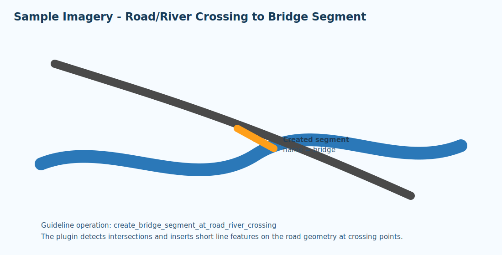

# Data Quality Check for Vectors (QGIS Plugin)

Data Quality Check for Vectors is a QGIS plugin for validating and improving vector data quality inside a user-selected area.

It combines classic QA checks (attributes, schema, geometry, topology) with profile-based guidelines, optional local Ollama assistance, and deterministic auto-fix workflows.

## Sample Imagery

### Processing Flow



### Guidelines Manager (sample UI layout)



### Road/River Crossing -> Bridge Segment (sample)



## Feature Summary

- Area selection:
  - Current map extent
  - Draw rectangle on map
- Attribute checks:
  - Required fields are not empty
  - Optional fill-if-empty autofix
- Schema checks:
  - Field-name homogeneity across selected layers
  - Optional schema harmonization (create missing fields)
- Geometry and topology checks:
  - Geometry validity (`native:checkvalidity` + fallback)
  - Road endpoint near-connectivity and elevation checks
- Topology repair workflow:
  - Uses `native:snapgeometries`
  - Preview mode (memory layer)
  - Commit mode (source layer geometry update)
- Local guidelines engine:
  - Base guidelines + profile-specific guidelines
  - Lexical retrieval with optional embeddings retrieval
  - Natural language guideline drafting
- Reports:
  - JSON
  - HTML
  - PDF
- Liability/claims enrichment for edited workflows:
  - Adds minimal STAC-derived attributes to editable vector layers:
    - `lc_claim_id`
    - `lc_claim_status`
    - `lc_claim_type`
    - `lc_responsible_party`
    - `lc_claim_date`
- Immutable catalogue candidate packaging:
  - `Store In Immutable Catalogue` button creates a feature package with per-feature SHA-256 digests
  - Output can be used as candidate input for immutable catalogue registration
  - Optional direct publish flow prompts for endpoint URL and bearer token, then POSTs the package

## Tabs Overview

### Validation Tab

- Select area and target vector layers
- Enable checks and optional repair/autofix
- Configure and run guidelines query
- Export report outputs
- Optionally click `Store In Immutable Catalogue` after checks to generate a candidate package for selected features
- After package creation, choose whether to POST directly to an Immutable Catalogue endpoint

### Guidelines Manager Tab

- Browse, create, edit, delete, and save guidelines per profile
- Build guideline drafts from natural language using the Guideline Assistant
- Use predefined examples to quickly populate prompts
- Edit operation params as JSON or plain language (auto-converted)

## Guidelines Engine

Guidelines are loaded from:

- `rules/quality_rules.json` (default/base guidelines)
- `rules/profiles/*.json` (profile-specific guidelines)

Each guideline uses this shape:

```json
{
  "id": "guideline-id",
  "name": "Human readable name",
  "description": "What this guideline does",
  "keywords": ["keyword1", "keyword2"],
  "action": "require_field_not_empty",
  "params": {
    "field": "copyright"
  }
}
```

## Supported Guideline Operations

### 1) `require_field_not_empty`

Checks that a field is present and not empty in selected area.

Params:

- `field`

### 2) `set_field_if_empty`

Fills empty values for a field.

Params:

- `field`
- `value_template`
- `create_if_missing` (default `true`)
- `fallback_to_full_layer_when_extent_empty` (default `true`)

### 3) `check_road_endpoint_snap_candidates`

Finds near endpoint pairs and optional candidate selection.

Params:

- `tolerance_m`
- `elevation_field`
- `select_candidates` (optional)

### 4) `create_bridge_segment_at_road_river_crossing`

Deterministic workflow that detects road-river crossings and creates a bridge segment feature on the road layer.

Params:

- `road_layer_contains` (default: `road`)
- `river_layer_contains` (default: `river`)
- `name_field` (default: `name`)
- `name_value` (default: `bridge`)
- `segment_half_length` (default: `1.0`, in layer units)
- `create_if_missing` (default: `true`)

Example prompt:

- `If a road is crossing a river create a segment for the crossing and name that element bridge.`

Example guideline:

```json
{
  "id": "road-river-bridge-segment",
  "name": "Create bridge segment at road-river crossing",
  "description": "Detect road and river crossings and create a bridge segment feature.",
  "keywords": ["road", "river", "crossing", "bridge"],
  "action": "create_bridge_segment_at_road_river_crossing",
  "params": {
    "road_layer_contains": "road",
    "river_layer_contains": "river",
    "name_field": "name",
    "name_value": "bridge",
    "segment_half_length": 1.0,
    "create_if_missing": true
  }
}
```

## Local LLM (Ollama)

Ollama is optional.

When enabled, the plugin can:

- Improve guideline retrieval with embeddings
- Convert natural-language guideline prompts into structured JSON
- Convert plain-language params into operation-specific JSON params

Default UI values:

- URL: `http://localhost:11434`
- Model: `nomic-embed-text`

Suggested setup:

1. Start Ollama locally.
2. Pull a model for embeddings and/or generation.
3. In plugin UI, enable `Use local LLM embeddings (Ollama)` and set model/URL.

If Ollama is unavailable, retrieval and guideline behavior fall back to deterministic lexical logic.

## Query Tips

### Literal values

Examples:

- `ensure copyright attribute exist and fill with "test"`
- `set copyright field to "test"`

### Dynamic values

Examples:

- `fill copyright with today date`
- `fill copyright with this year`
- `set copyright field to now`

Resolved values:

- `today date` -> `YYYY-MM-DD`
- `this year` -> `YYYY`
- `now` -> `YYYY-MM-DD HH:MM:SS`

## Report Export

Select one or more formats and output folder:

- JSON
- HTML
- PDF

Reports include timestamp, active profile, AOI extent, and full report lines.

## Installation (Development)

1. Copy folder `data_quality_check_vectors` to your QGIS plugins directory.
2. Restart QGIS.
3. Enable plugin from Plugins -> Manage and Install Plugins -> Installed.

Typical plugin paths:

- macOS: `~/Library/Application Support/QGIS/QGIS3/profiles/default/python/plugins/`
- Linux: `~/.local/share/QGIS/QGIS3/profiles/default/python/plugins/`
- Windows: `%APPDATA%/QGIS/QGIS3/profiles/default/python/plugins/`

## Quick Start

1. Open plugin from toolbar/menu.
2. Select area and target vector layers.
3. Keep default checks enabled for first pass.
4. Choose profile (`default`, `roads`, `cadastre`, or `emergency_response`).
5. Add a guideline query (optional) and run checks.
6. Export report.

For bridge creation:

1. Open Guidelines Manager.
2. Use example: road crossing river -> bridge.
3. Generate guideline draft, save guideline, save profile.
4. Go back to Validation tab, enable autofix, run checks.

## Troubleshooting

- No guidelines retrieved:
  - Verify selected profile contains matching guideline keywords.
  - Try a more explicit query.
- Ollama not responding:
  - Verify URL and local service state.
  - Disable Ollama option to use lexical fallback.
- Autofix did not write changes:
  - Check layer/provider write capabilities.
  - Confirm layer is not read-only.
  - Confirm operation supports write behavior.

  Note:
  The internal JSON key name remains `action` for compatibility, even though the UI/documentation refers to it as an operation.
- Bridge segments not created:
  - Check road/river layer naming against `road_layer_contains` and `river_layer_contains`.
  - Confirm both layers have line geometries.
  - Ensure crossings exist in selected area.

## Notes

- Some edits are left in an active edit session to let users review before final commit.
- Geometry and provider capabilities vary by datasource type.
- Responsibility for validating the suitability, legality, and consequences of any use of this plugin and its outputs remains entirely with the final user.

## License

This plugin is licensed under the GNU Affero General Public License v3.0 (AGPL-3.0-or-later).

License reference:

- https://www.gnu.org/licenses/agpl-3.0.en.html
